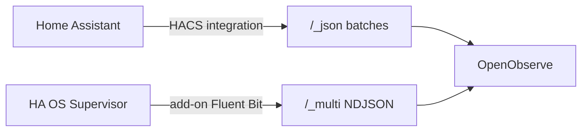

# Project context — saved 2026-05-20 (updated)

## Architecture



| Component | Repo | Stream(s) | Ingest |
|-----------|------|-----------|--------|
| HACS integration | [Shaffer-Softworks/Openobserve](https://github.com/Shaffer-Softworks/Openobserve) | `home_assistant_logs`, `home_assistant_events` | `/_json` |
| Supervisor add-on | [home-assistant-openobserve-addon](https://github.com/Shaffer-Softworks/home-assistant-openobserve-addon) | `home_assistant_supervisor` | `/_multi` |

Monorepo split 2026-05-20; add-on lives in separate repo.

## Integration repo (this)

- `custom_components/openobserve/`, domain `openobserve`, version **0.2.2**
- Forwards HA system logs + bus events (lifecycle, `state_changed`, `call_service`, etc.)
- Options: log level, event toggles, exclude globs, batch size, flush interval
- Tests: `tests/test_handler.py`
- Release tag on GitHub: `v0.2.0` (bump tag when publishing 0.2.2+)

### Thread safety (v0.2.1 / v0.2.2)

**Symptom:** `hass.async_create_task from a thread other than the event loop` at `client.py` when `state_changed` volume is high; “Future exception was never retrieved”.

**Cause:** Sync bus listeners run in HA’s thread pool; old code called `async_create_task` from `enqueue_event`.

**Fix (0.2.2):**
- `__init__.py`: all `bus.async_listen` handlers are `async def`
- `client.py`: `_run_on_hass_loop()` for enqueue; `_schedule_flush()` for batch flush (debounced)
- `log_handler.py`: `enqueue_log()` only (no duplicate `call_soon_threadsafe`)

### Config flow (v0.1.1+)

`OpenObserveOptionsFlowHandler`: `self._config_entry` only — never `self.config_entry = …` or `super().__init__(config_entry)`.

### HACS

- Custom repo: `https://github.com/Shaffer-Softworks/Openobserve`
- Default-store PR: https://github.com/hacs/default/pull/7820 (open, CI was green)
- Checklist: `docs/HACS_DEFAULT.md`

### Docker dev test

```bash
export ZO_ROOT_USER_PASSWORD='your-password'
./deploy/docker/run.sh
```

- OpenObserve: http://localhost:5080 — HA: http://localhost:8123
- Integration URL: `http://openobserve:5080` (not `localhost`)

### Production

LAN OpenObserve: `http://10.20.0.54:5080`, org `default`.

## Add-on repo

- https://github.com/Shaffer-Softworks/home-assistant-openobserve-addon
- `openobserve_log_shipper/`, v0.1.0, HA OS / Supervisor only

## Resolved issues

| Issue | Fix |
|-------|-----|
| OpenObserve login 401/500 | Fresh volume; `ZO_ROOT_*` on first boot only |
| Config flow 500 | `_config_entry` pattern (HA 2025.12+) |
| `async_create_task` / thread safety | v0.2.2 async listeners + `_run_on_hass_loop` / `_schedule_flush` |
| HACS Sorted CI | casefold: after `hyperhdr-ha` |
| Cursor co-author in commits | History rewrite + force-push |

## Key files

| File | Role |
|------|------|
| `custom_components/openobserve/client.py` | Buffers, thread-safe enqueue, flush |
| `custom_components/openobserve/__init__.py` | Setup, async bus listeners |
| `custom_components/openobserve/config_flow.py` | Config/options flows |
| `deploy/docker/run.sh` | Local two-container deploy |
| `docs/HACS_DEFAULT.md` | HACS default store submission |

## Icon attribution

[Dashboard Icons — open-observe](https://dashboardicons.com/icons/open-observe) (Apache-2.0).
