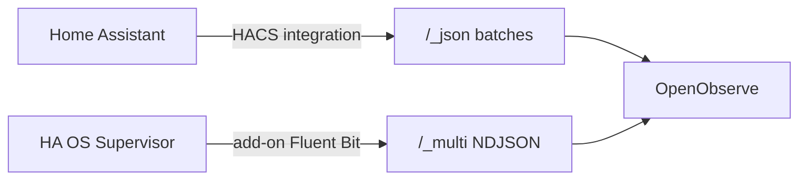

# Project context — saved 2026-05-20

## Architecture



| Component | Repo | Stream(s) | Ingest |
|-----------|------|-----------|--------|
| HACS integration | [Shaffer-Softworks/Openobserve](https://github.com/Shaffer-Softworks/Openobserve) | `home_assistant_logs`, `home_assistant_events` | `/_json` |
| Supervisor add-on | [home-assistant-openobserve-addon](https://github.com/Shaffer-Softworks/home-assistant-openobserve-addon) | `home_assistant_supervisor` | `/_multi` |

Monorepo split on 2026-05-20; add-on removed from integration repo.

## Integration repo (this)

- Path: `custom_components/openobserve/`, domain `openobserve`, version **0.2.0**
- Forwards HA system logs + bus events (lifecycle, state_changed, call_service, etc.)
- Options: log level, event toggles, exclude globs, batch size, flush interval
- Tests: `tests/test_handler.py` (no HA runtime)
- Releases: https://github.com/Shaffer-Softworks/Openobserve/releases/tag/v0.2.0

### Config flow fix (v0.1.1+)

`OpenObserveOptionsFlowHandler`: `self._config_entry` only — never `self.config_entry = …` or `super().__init__(config_entry)`.

### HACS publishing

- Validate workflow: hassfest + HACS action (brands validated via in-repo `brand/`)
- Repo topics: `home-assistant`, `hacs`, `openobserve`, `integration`
- Default-store PR: https://github.com/hacs/default/pull/7820 (`sickkick/HACS`, branch `add-openobserve`)
- See `docs/HACS_DEFAULT.md`

### Install (until default merge)

HACS → Custom repositories → `https://github.com/Shaffer-Softworks/Openobserve`

### Docker dev test

```bash
export ZO_ROOT_USER_PASSWORD='your-password'
./deploy/docker/run.sh
```

- OpenObserve: http://localhost:5080
- HA: http://localhost:8123
- Integration base URL: `http://openobserve:5080` (not localhost)

### Production

LAN OpenObserve at `http://10.20.0.54:5080`, org `default` — used by real HA instance, not the Docker test stack.

## Add-on repo

- `openobserve_log_shipper/` — tails `/config/home-assistant.log`
- Requires HA OS / Supervisor; v0.1.0 release
- Add-on store URL: `https://github.com/Shaffer-Softworks/home-assistant-openobserve-addon`

## Resolved issues (reference)

| Issue | Fix |
|-------|-----|
| OpenObserve login 401/500 | Fresh volume; `ZO_ROOT_*` only on first boot |
| Config flow 500 | `_config_entry` pattern (HA 2025.12+) |
| HACS Sorted CI fail | casefold order: entry after `hyperhdr-ha` |
| Cursor co-author in commits | `git filter-branch` + force-push main |

## Key files

| File | Role |
|------|------|
| `custom_components/openobserve/config_flow.py` | Config/options flows |
| `custom_components/openobserve/client.py` | Batching, ingest client |
| `deploy/docker/run.sh` | Local two-container deploy |
| `docs/HACS_DEFAULT.md` | Default HACS store checklist |

## Icon attribution

[Dashboard Icons — open-observe](https://dashboardicons.com/icons/open-observe) (homarr-labs/dashboard-icons, Apache-2.0).
